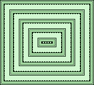

# Gameboy Test Screen Alignment Program

This is a simple project that renders a test screen pattern on a Gameboy.
The pattern uses a set of border tiles that repeat alternating pixels. The idea
is that if you have the reference image, you should be able to see if any pixels
are cut off during an IPS screen installation.

My modded Gameboys use the Q5 screen available from
[Handheld Legend](https://handheldlegend.com/products/game-boy-dmg-ips-lcd-v4-front-pcb-hispeedido)
. This screen is able to adjust the image post IPS screen install.

## Build instructions
To build the project and use all `make` directives, ensure that the
following environment variables are set. These specify the paths to
the `make` directive dependencies.

### Environment Variables

- `SDCCDIR`: Path to the `SDCC` project directory (ends in `/sdcc`)
- `GBDK2020`: Path to the `GBDK-2020` project directory (ends in `/build/gbdk`)
- `EMULICIOUS`: Path to `Emulicious` project directory (ends in `/Emulicious`)
- `GBSDDIR`: Path to an SD card mount point to copy `.gb` files to.
    - I am currently using an [Everdrive GB x7](https://krikzz.com/our-products/cartridges/edgbx7.html)

### `make` Directives
- `make`: Builds the project into `bin/gb_test_screen_alignment.gb`
- `make run`: Builds the product and launches it in `Emulicious`
- `make deploy`: Builds the product and copies the `.gb` file to an SD Card
- `make clean`: Removes build files in `bin/`

## Toolchain
This project is utilizing the [GBDK-2020](https://github.com/gbdk-2020/gbdk-2020)
cross-platform toolkit as its base, on Linux.

The compiler is identified by the environment variable `GBDK2020`, that
points to the install location to `gbd-2020`. In other words, this is the path
that contains `bin/llc`.

I was a madman and decided to build the project myself, so my path ends in
`gdk-2020/build/gbdk`.

### Emulation
I used [Emulicious](https://emulicious.net/) as the primary development 
emulator, accompanied with the Emulicious VS Code extension.

`make run` will build the project and then start Emulicious, so long as the 
environment variable, `EMULICIOUS` is set and points to the directory
containing `Emulicious.jar`.

### Tile/Sprite Tooling
I used the new GBDK-2020 releases of the
[Gameboy Tile Designer & Gameboy Map Builder](https://github.com/gbdk-2020/GBTD_GBMB)
and ran them using [wine](https://www.winehq.org/).
